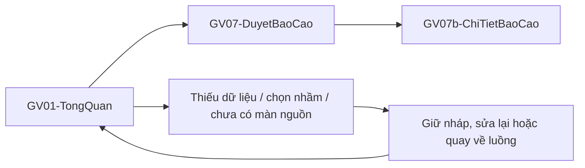
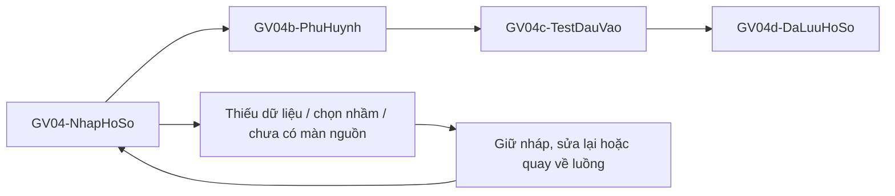
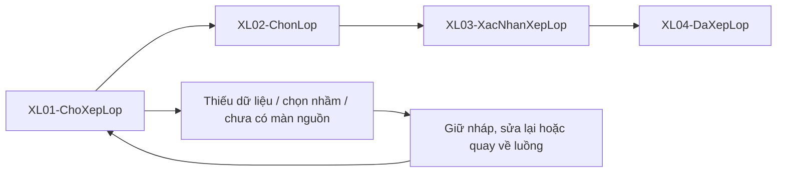

# Luồng nhiệm vụ

Các luồng dưới đây mô tả prototype, không chứng minh hành động trên backend.

## Xử lý việc cần ưu tiên

```mermaid
flowchart LR
 N0["GV01-TongQuan"] --> N1["GV07-DuyetBaoCao"] --> N2["GV07b-ChiTietBaoCao"]
 N0 --> E["Thiếu dữ liệu / chọn nhầm / chưa có màn nguồn"]
 E --> R["Giữ nháp, sửa lại hoặc quay về luồng"]
 R --> N0
```

## Tiếp nhận học sinh

```mermaid
flowchart LR
 N0["GV04-NhapHoSo"] --> N1["GV04b-PhuHuynh"] --> N2["GV04c-TestDauVao"] --> N3["GV04d-DaLuuHoSo"]
 N0 --> E["Thiếu dữ liệu / chọn nhầm / chưa có màn nguồn"]
 E --> R["Giữ nháp, sửa lại hoặc quay về luồng"]
 R --> N0
```

## Xếp lớp phù hợp

```mermaid
flowchart LR
 N0["XL01-ChoXepLop"] --> N1["XL02-ChonLop"] --> N2["XL03-XacNhanXepLop"] --> N3["XL04-DaXepLop"]
 N0 --> E["Thiếu dữ liệu / chọn nhầm / chưa có màn nguồn"]
 E --> R["Giữ nháp, sửa lại hoặc quay về luồng"]
 R --> N0
```
